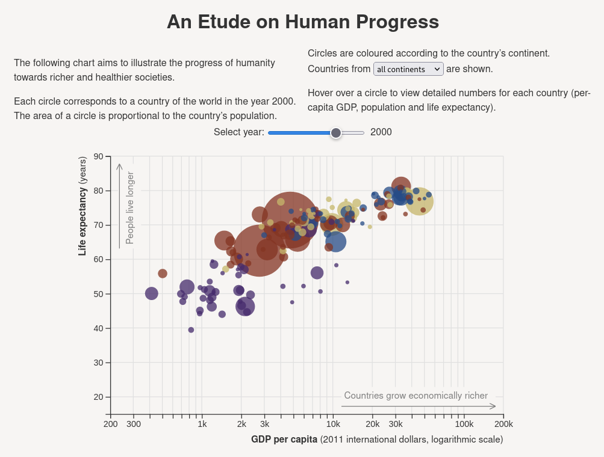

# Bubble Chart

Hello, world! This is a simple web app demonstrating an aspect of human progress over time using a bubble chart à la [Hans Rosling](https://www.youtube.com/watch?v=hVimVzgtD6w). It is built using React, D3.js and TypeScript with Vite as the build system.

The app is deployed at [mgrabovsky.eu/bubble-chart](https://mgrabovsky.eu/bubble-chart).

